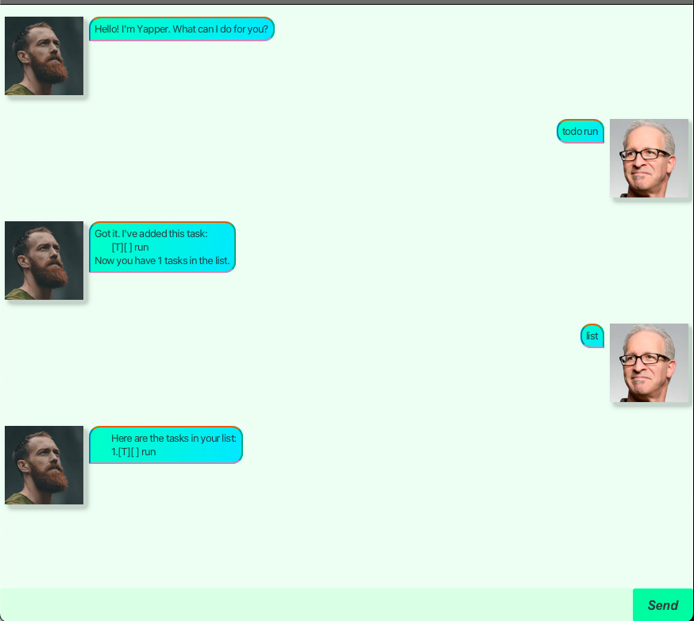

# Yapper User Guide



Yapper is a lightweight and intuitive list-tracking application designed to help users stay organised. Whether you need to manage tasks, events, or deadlines, 
Yapper provides a simple yet powerful way to track your items efficiently.

## Adding tasks

// Describe the action and its outcome.
Yapper provides functionality for 3 types of tasks:
1. `todo`: This command adds a basic task to your list.  
    * Format: `todo {taskname}`
2. `deadline`: This command adds a task with a deadline.
    * Format: `deadline {deadline name} /by YYYY/MM/DD.` 
3. `event`: This command adds a task with a start and end time.
    * Format: `event (event name) /from YYYY/MM/DD HHMM /to YYYY/MM/DD HHMM`
    * Note: HHMM is in 24-hr format (e.g. 1559)


Example: `event Annual Meeting /from 2025/02/01 1500 /to 2025/02/01 1700`

Expected outcome:
```
Got it. I've added this task:
   [E](] Annual Meeting (from: 2025-02-01 15:00 to: 2025-02-01 17:00)
Now you have 1 tasks in the list.
```

## Listing Tasks

// Feature details
Here's how you can list your tasks: `list`
Expected output:
```
Here are the tasks in your list:
1.[E][] Annual Meeting (from: 2025-02-01 15:00 to: 2025-02-01 17:00)
```

## Mark / Unmark tasks as completed

Here's how you can mark / unmark your tasks using `mark` and `unmark`:

For `mark 1` where `1` refers to the index referenced by `list`:
```
Nice! I've marked this task as done:
   [E][X] Annual Meeting (from: 2025-02-01 15:00 to: 2025-02-01 17:00)
```

For `unmark 1` where `1` refers to the index referenced by `list`:
```
OK, I've marked this task as not done yet:
   [E][] Annual Meeting (from: 2025-02-01 15:00 to: 2025-02-01 17:00)
```

## Delete

Here's how you can delete your tasks using `delete`:

Input: `delete 1` where `1` refers to the index referenced by `list`:
```
Noted. I've removed this task:
   [E][] Annual Meeting (from: 2025-02-01 15:00 to: 2025-02-01 17:00)
Now you have 0 tasks in the list.
```
